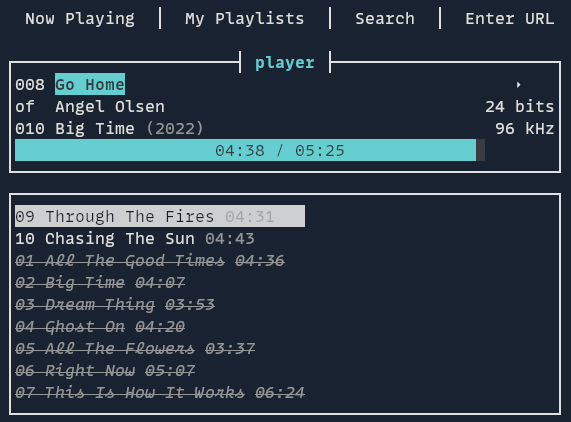

# hifi.rs

### A terminal-based (tui), high resolution audio player backed by Qobuz

Powered by [Qobuz](https://www.qobuz.com). Requires a paid subscription. This does not allow you to listen for free.

Qobuz only supports Linux through the browser and has no officially supported API. There are ways of accessing Qobuz in Linux outside of the browser through third-party applications like Squeezelite and Roon. These apps are great, but I wanted something simpler that just focused on being able to quickly find and play an album inside the console.



## Player Features

- Low resource usage
- [GStreamer](https://gstreamer.freedesktop.org/)-backed player, [SQLite](https://www.sqlite.org/index.html) database
- High resolution audio: Supports up to 24bit/192Khz (max quality Qobuz offers)
- MPRIS support (control via [playerctl](https://github.com/altdesktop/playerctl) or other D-Bus client)
- Gapless playback
- Resume last session
- TUI can be disabled to use as a headless player, controlled via MPRIS

In addition to the player, there is a Spotify to Qobuz playlist sync tool and an incomplete Rust library for the Qobuz API.

## Installation

Download tar from releases page, extract the tar and execute it or copy it to the your $PATH.

## Get started

Run `hifi-rs --help` or `hifi-rs <subcommand> --help` to see all available options.

To get started:

```shell
hifi-rs config username # enter username at prompt
hifi-rs config password # enter password at prompt
hifi-rs config default-quality # enter quality at prompt (mp3, cd, hifi96 or hifi192)
hifi-rs play --uri <Qobuz Album, Playlist or Track URL>
```

## Keyboard Shortcuts

| Command             | Key(s)                                 |
| ------------------- | -------------------------------------- |
| Switch screen       | <kbd>tab</kbd>                         |
| Play/Pause          | <kbd>space</kbd>                       |
| Next track          | <kbd>N</kbd>                           |
| Previous track      | <kbd>P</kbd>                           |
| Jump forward        | <kbd>l</kbd> or <kbd>right arrow</kbd> |
| Jump backward       | <kbd>h</kbd> or <kbd>left arrow</kbd>  |
| Quit                | <kbd>ctrl</kbd> + <kbd>c</kbd>         |
| Move up in list     | <kbd>k</kbd>                           |
| Move down in list   | <kbd>j</kbd>                           |
| Select item in list | <kbd>enter</kbd>                       |
| Dismiss popup       | <kbd>esc</kbd>                         |
| Enter search query  | <kbd>/</kbd>                           |

## Known Issues

- If left paused for a while, the player will crash when attempting to play again
- UI will freeze during loading of long lists and then works fine. The issue is there is no feedback alerting the user that something is happening in the background and signifying it is normal behavior. Probably best solved when switching to Cursive.

## Todo

- Build binaries and make Github releases
- Use unified search endpoint instead of individual
- Switch to [Cursive](https://crates.io/crates/cursive) for UI library
- Enable searching for albums, tracks and playlists in the UI
- Sortable lists
